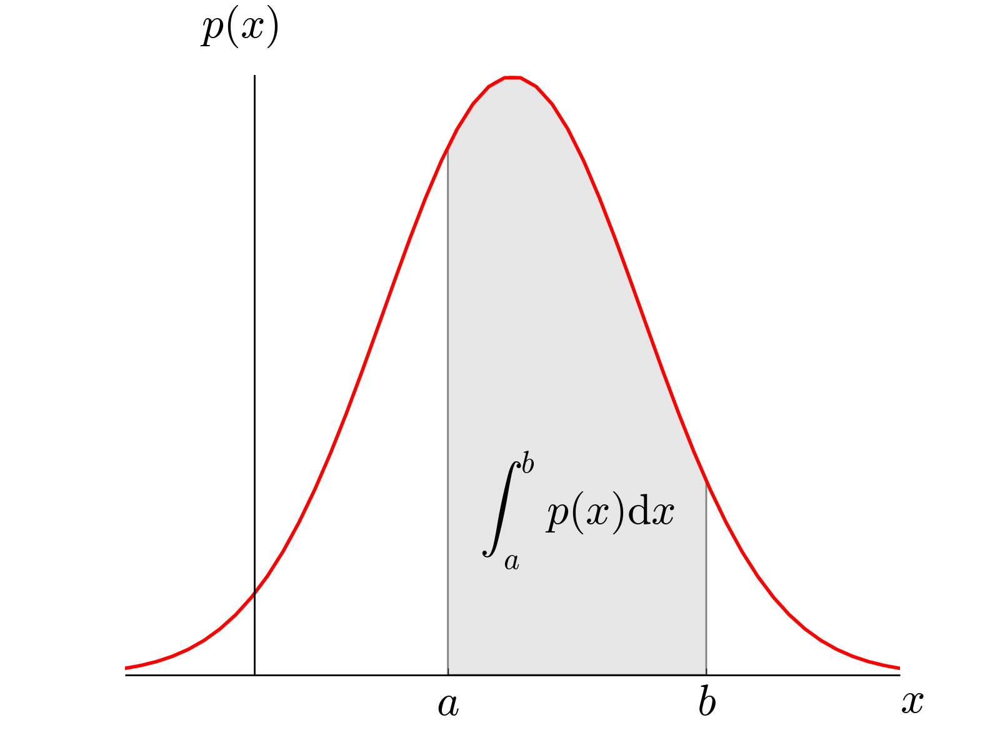

---
output:
  html_document: default
  pdf_document: default
---
# Vecteurs aléatoires 

## Objectifs

L'objectif de cette séance est d'établir un catalogue de notions mathématiques de base permettant d'aborder la science des données. Pour certaines notions, il s'agit de rappels de concepts connus (loi de probabilité, espérance, variance). Pour les autres, il s'agit de généraliser à des vecteurs aléatoires les notions unidimensionnelles s'appliquant aux variables aléatoires.

Ces notions concernent la définition des vecteurs aléatoires et leurs principales propriétés. Nous définirons les notions probabilistes utiles pour traiter des données de grande dimension, en particulier la notion de _matrice de covariance_. 


## Notations

Nous utiliserons les conventions de notation suivantes. 

- ${\bf x}$ : (minuscule grasse) vecteur aléatoire de dimension $D$ noté comme un vecteur colonne. La transposée du vecteur  ${\bf x}$ est un vecteur ligne

$$
{\bf x}^T = (x_1, \dots, x_D) \, .
$$

- $x,y$ : (minuscules) variables aléatoires unidimensionnelles. Les variables $x$ ou $y$ peuvent représenter les coordonnées d'un vecteur de plus grande dimension. Par ailleurs $y$ peut être une variable discrète (catégorielle) représentant le classement d'un vecteur ${\bf x}$ en plusieurs catégories.

- ${\bf A}$ : (majuscule grasse) matrice de dimension $D\times D$, $D \geq 2$. D'autres dimensions sont envisageables. En particulier, les matrices ne sont pas toutes carrées.

- ${\bf X}$ : (majuscule grasse) matrice de données de dimension $n\times D$ où $n$ représente la _taille d'un échantillon_ et $D$ la dimension des vecteurs aléatoires mesurés dans l'échantillon. L'étude de matrices de données ${\bf X}$ est l'un des objectifs de ce cours.

- $p_{\sf x}$ (noter l'absence de sérif) : loi de la variable aléatoire $x$ ou du vecteur aléatoire ${\bf x}$. La fonction réelle $p_{\sf x}(x)$ représentera la _densité_ de la variable $x$. Lorsque le contexte n'est pas ambigu, la notation (abusive) $p(x)$ remplacera la notation $p_{\sf x}(x)$ par souci de lisibilité des formules.

Bien qu'il existe d'autres convention de notation, les conventions précédentes sont universellement adoptées dans le domaine de l'apprentissage automatique.

## Variables aléatoires réelles

### Loi, espérance, variance.

On appelle *densité de probabilité*, définie sur $\mathbb{R}$ ou sur une partie de $\mathbb{R}$, toute fonction $p(x)$ positive ou nulle dont l'intégrale sur l'ensemble de définition est égale à 1.

Soit $x$ une variable aléatoire à valeurs réelles. On dit que $x$ admet $p(x)$ pour densité si la probabilité pour que $x$ appartienne à l'intervalle $I = (a,b]$ est égale à 

$$
p(x \in (a,b]) = \int_a^b p(x) dx \, .
$$
Bien entendu, la désignation de la variable $x$ à l'intérieur de l'intégrale est arbitraire. Elle n'est ici que pour nous rappeler que nous travaillons avec une variable aléatoire nommée $x$. Si $x$ représente la taille d'un individu pris au hasard dans une population infinie, on pourrait tout aussi bien écrire
$$
p({\rm taille} \in (1.56,1.87]) = \int_{1.56}^{1.87} p(x) dx \, ,
$$

ou 
$$
p({\rm taille} \in (1.56,1.87]) = \int_{1.56}^{1.87} p(v) dv \, ,
$$

sans que cela change la valeur de la probabilité. Dans tous les cas, il s'agit de l'aire sous la courbe de la fonction de densité comprise entre les valeurs $a$ et $b$.




Lorsque cette grandeur est bien définie, on appelle _espérance_ (ou valeur moyenne) de la variable aléatoire $x$ l'intégrale égale à

$$
\mathbb{E}[x] = \int_{\mathbb{R}} x p(x) dx \, .
$$

Lorsque cette grandeur est finie, on appelle _variance_ de la variable aléatoire $x$ la grandeur égale à

$$
{\rm var}[x] = \mathbb{E}[(x - \mathbb{E}[x])^2] \, .
$$

L'espérance représente la _valeur moyenne_ de la variable $x$ attendue lors d'un tirage aléatoire selon la loi de densité $p(x)$. La variance représente l'_écart quadratique à la moyenne_ attendu lors d'un tirage aléatoire selon la loi de densité $p(x)$.

L'_écart-type_ à la moyenne est défini de la manière suivante 

$$
{\rm sd}[x] = \sqrt{{\rm var}[x]} \, .
$$

Considérons deux variables aléatoires réelles $x$ et $y$ et supposons que leurs variances sont finies. On définit la _covariance_ des variables $x$ et $y$ de la manière suivante

$$
{\rm cov}[x,y] = \mathbb{E}[(x - \mathbb{E}[x]) (y - \mathbb{E}[y]) ] \, .
$$

Les propriétés suivantes sont rappelées pour leur importance dans les calculs probabilistes.

1. **L'espérance est linéaire** : pour tout couple de scalaires $(a,b)$, nous avons $\mathbb{E}[ax + by] = a\mathbb{E}[x] + b\mathbb{E}[y]$.

2. **La variance est quadratique** : pour tout couple de scalaires $(a,b)$, nous avons ${\rm var}[ax + by] = a^2{\rm var}[x] + b^2{\rm var}[y] + 2ab {\rm cov}[x,y]$.

3. **La covariance est symétrique** : ${\rm cov}[x,y] = {\rm cov}[y,x]$. De plus, nous avons 

$$
{\rm cov}[x,y] = \mathbb{E}[xy] - \mathbb{E}[x] \mathbb{E}[y]  \, .
$$

4. Si les variables $x$ et $y$ sont indépendantes, alors ${\rm cov}[x,y] = 0$.

5. _Théorème de transfert_. Si $f(x)$ est une fonction de $x$ dont l'espérance est bien définie, alors son espérance est égale à 

$$
\mathbb{E} [f(x)] = \int_{\mathbb{R}} f(x) p(x) dx .
$$
Lorsque les bornes ne sont pas indiquées, l'intégrale porte sur toutes les valeurs dont la densité est non nulle. 

Nous verrons en travaux dirigés un exemple de calcul d'espérance permettant de calculer l'entropie de Shannon d'une loi de probabilité. Pour donner un exemple plus simple, considérons la fonction de densité de la loi uniforme sur $(0,1)$

$$
p(x) = \left\{ 
\begin{array}{ll}
1 & {\rm si ~ } x \in (0,1), \\
0 & {\rm si ~ } x \notin (0,1).
\end{array}
\right.
$$
Le calcul de l'espérance de cette loi donne le résultat suivant

$$
\mathbb{E}[x] = \int_0^1 x p(x) dx = \int_0^1 x dx = \frac12. 
$$
En langage R, nous pouvons effectuer 100000 tirages de loi uniforme de la manière suivante

```{r}
  x <- runif(100000)
```

La valeur moyenne arrondie à 2 décimales est égale à


```{r, include = FALSE}
library(magrittr)
```


```{r}
  mean(x) %>% round(digit = 2)
```


La covariance peut être interprétée comme une mesure de l'effet d'une variable sur une autre. Pour cela, supposons que les variables $x$ et $y$ sont reliées par une relation "linéaire"

$$
 y = ax + \epsilon, 
$$
où $a$ est un scalaire quelconque et $\epsilon$ une variable aléatoire indépendante de $x$ (on dit parfois un *bruit*). Nous avons alors

$$
{\rm cov}[x,y] = {\rm cov}[x, ax + \epsilon] = a{\rm cov}[x, x] + {\rm cov}[x, \epsilon] \, .
$$
D'après les propriétés précédentes, nous avons

$$
{\rm cov}[x,y] = {\rm cov}[x, ax + \epsilon] = a{\rm var}[x] \, .
$$
Lorsque l'effet ($a$) est positif, la covariance est positive et lorsque l'effet est négatif, la covariance devient négative. Nous voyons que l'effet $a$ s'exprime simplement en fonction de la covariance

$$
a = \frac{{\rm cov}[x,y]}{{\rm var}[x]} .
$$
L'effet est nul lorsqu'il n'y a pas de dépendance entre $y$ et $x$.

###  Valeurs empiriques, loi des grands nombres

Une loi de probabilité représente un modèle idéalisé de la répartition (on dit parfois distribution) d'une variable aléatoire. Ce modèle correspond à la répartition des valeurs de cette variable dans une population de taille infiniment grande. 

Dans les applications pratiques, il est impossible d'échantillonner l'ensemble d'une telle population. On dispose d'un échantillon de taille finie, égale à $n$. Cet échantillon est obtenu en considérant $n$ tirages successifs de la variable étudiée. Les tirages sont généralement indépendants. 

La loi des grands nombres, énoncée sous des hypothèses raisonnables (tirages indépendants et de loi identique, variance finie), permet d'approcher l'espérance de toute fonction de $x$, $f(x)$, par la moyenne des valeurs de tirages successifs, $f(x_i)$, $i = 1, \dots, n$

$$
\mathbb{E} [f(x)] \approx \frac1n \sum_{i=1}^n f(x_i) \, .
$$

Pour bien comprendre le sens de cette relation, appliquons la à la fonction $f(x) = x$. Nous avons alors

$$
\mathbb{E} [x] \approx \frac1n \sum_{i=1}^n x_i \, .
$$

L'espérance s'interprète ainsi comme la valeur moyenne des tirages successifs. Pout comprendre pourquoi, supposons un instant que la variable $x$ prenne un nombre fini de valeurs. La somme porte sur l'indice des tirages, et peut réorganisée en portant sur l'ensemble des valeurs possibles. Nous voyons alors apparaître la formule de l'espérance en approchant la fréquence d'apparition de chaque valeur par la probabilité de cette valeur

$$
\frac1n \sum_{i=1}^n x_i =  \sum_{x} x \frac{\# \{i; \, x_i = x \}}n \approx \sum_{x} x p(x)  \, .
$$


Cette approximation permet de remplacer les valeurs théoriques des espérances par des valeurs empiriques, faciles à calculer en général. En supposant les tirages indépendants et de même loi, il est possible évaluer l'erreur d'approximation effectuée en moyenne. Cette erreur, élevée au carré, correspond à la variance de la variable aléatoire $\frac1n \sum_{i=1}^n f(x_i)$ (plus la variance est petite, meilleure est l'approximation)

$$
\mathbb{E} \left[(\sum_{i=1}^n f(x_i)/n - \mathbb{E} [f(x)])^2 \right] = {\rm var} [\sum_{i=1}^n f(x_i)/n] = \frac1n {\rm var}[f(x)] \to 0 \, .
$$

Dans la suite de ce cours et notamment dans les algorithmes d'apprentissage automatique, les tailles d'échantillon seront élevées. Notons que cela peut demander des efforts d'échantillonnage ou d'annotation des observations par des humains très conséquents. 


Pour faciliter les analyses théoriques, certaines valeurs empiriques, telles que les fonctions d'évaluation des algorithmes d'apprentissage, seront remplacées par des espérances. Dans ces applications, nous garderons à l'esprit que l'ordre de grandeur de l'erreur effectuée en rempla\c cant une valeur empirique par son espérance est négligeable. En moyenne, l'erreur d'approximation est de l'ordre de la racine carrée de la variance calculée ci-dessus. Elle est donc égale à $O(1/\sqrt{n})$, où $O(u_n)$ désigne la notation de Landau.

Par exemple, lorsque nous substituons la valeur moyenne à l'espérance de la manière suivante

$$
\bar{x} = \frac1n \sum_{i=1}^n x_i \approx \mathbb{E}[x]  \, ,
$$

l'erreur moyenne est de l'ordre $O(1/\sqrt{n})$. En effet, l'erreur quadratique moyenne est égale à 

$${\rm var}[\bar{x}] =  \frac1n {\rm var}[x] \, ,  $$
et l'erreur est du même ordre que l'écart-type, c'est à dire $O(1/\sqrt{n})$.


La formule ci-dessus montre comment nous pouvons estimer la valeur de l'espérance par une moyenne empirique. Dans la suite, nous calculons les variances et covariances empiriques de la manière suivante

$$
{\rm var}[x] \approx \frac1n \sum_{i=1}^n (x_i - \bar{x})^2 \, ,
$$
et

$$
{\rm cov}(x,y) \approx \frac1n \sum_{i=1}^n (x_i - \bar{x})(y_i - \bar{y}).
$$
Le cours de statistique vous apprendra que l'on corrige parfois ces estimations lorsque les échantillons sont de petite taille en remplacant $1/n$ par $1/(n-1)$ devant la somme.


###  Loi normale $N(m,\sigma^2)$ (loi de Gauss)

La loi normale $N(0,1)$ est très importante dans les applications en science des données. Elle est définie par la densité suivante 

$$
p(z) = \frac{1}{\sqrt{2\pi}} \exp(-\frac{z^2}{2}) \, , \quad  z \in \mathbb{R} .   
$$
Son espérance est égale à 0 et sa variance est égale à 1. Sa représentation graphique est donnée par la courbe de Gauss.

```{r cm2_dist_gauss, echo = FALSE}
x <- seq(-4,4,length = 500)
plot(x, dnorm(x, 0, 1), type = 'l', lwd = 2, col = "orange", main = "Loi de Gauss N(0,1)")
```


La loi normale $N(m,\sigma^2)$ est la loi de la variable $x = m + \sigma z$ où $z$ est de loi $N(0,1)$. On obtient immédiatement que l'espérance de la loi $N(m,\sigma^2)$ est égale à $m$ et que sa variance est égale à $\sigma^2$. La densité de la loi normale $N(m,\sigma^2)$ est donnée par la formule suivante

$$
p(x) = \frac{1}{\sqrt{2\pi \sigma^2}} e^{-\frac{(x-m)^2}{2\sigma^2}} \, , \quad  x \in \mathbb{R} . 
$$


Afin d'illustrer les valeurs empiriques mentionnées dans la section précédente, considérons un échantillon de taille $n = 1000$ tiré selon la loi normale $N(m = 10, \sigma^2 = 4)$. Calculons les valeurs empiriques correspondant à la moyenne et à la variance de cette loi. Nous nous attendons à observer des valeurs proches de 10 et de 4.

```{r}
x <- rnorm(n = 1000, m = 10, sd = 2)
cat("moyenne =", mean(x),"\n")
cat("variance =", var(x),"\n")
```

Nous observons que les erreurs sont de l'ordre de $1/\sqrt{1000} = 0.03$.  Nous pouvons aussi calculer la probabilité que la variable se trouve entre 10 et 11. Pour cet événement, la valeur empirique de la probabilité est égale à

```{r}
mean(x > 10 & x < 11)
```

la valeur théorique est égale à 
```{r}
pnorm(11, m = 10, sd = 2) - pnorm(10, m = 10, sd = 2) 
```

La fonction `pnorm(t) correspond à la fonction de répartition de la loi normale, égale à $p(x \leq t)$.  Cette fonction n'a pas d'expression analytique connue. Elle est calculée numériquement par le logiciel.


Profitons de cet exemple pour analyser la particularité de la manipulation des vecteurs en R. La condition `(x > 10 & x < 11)` correspond en fait à un vecteur booléen de longueur $n$. La commande `mean` effectue la moyenne des valeurs de ce vecteur et calcule ainsi la probabilité empirique de la condition. Le calcul des probabilité en R est donc simplifié. L'expression 

```{r}
mean(x > 10 & x < 11)
```
calcule donc une valeur approchée de la probabilité
$$
p(x > 10 {\rm ~ et ~} x < 11).
$$
Elle est equivalente au code suivant, plus long à exécuter,

```{r}
n <- length(x)
somme <- 0

  for (i in 1:n){
    if (x[i] > 10 & x[i] < 11) {
      somme <- somme + 1
   } 
  }

somme/n
```


### Entropie de la loi $N(0, \sigma^2)$

Dans la séance de travaux dirigés correspondant à ce cours, nous verrons que la loi normale $N(0,\sigma^2)$ est la _loi d'entropie maximale_ parmi toutes les lois définies sur $\mathbb{R}$ dont l'espérance est nulle et dont la variance existe et est égale à $\sigma^2$. La conséquence de ce résultat est que la loi de Gauss est un modèle naturel pour l'incertitude dans les phénomèmes aléatoires. Analyser ou exploiter la variabilité des données constituera un objectif majeur de la science des données dans la suite du cours. 

Pour toute loi de probabilité $p$, l'_entropie de Shannon_ (ou _information_) est définie par

$$
h(p) = - \int p(x) \log p(x) dx  \,.
$$

Considérons la densité de la loi normale de moyenne nulle et de variance $\sigma^2$, $p(x) = N(x|m = 0, \sigma^2)$. En notant que la variance de la loi normale est égale à $\sigma^2$, nous obtenons

$$
h(p) = 1/2 +  \log (\sqrt{ 2 \pi \sigma^2}).
$$

En simplifiant, nous obtenons

$$
h(p) =  \frac12 \log ( 2 \pi e \sigma^2) . 
$$

Cette relation établit le lien existant entre l'entropie de Shannon et la variance. Nous verrons plus loin que la moyenne ne porte pas d'information dans la loi de Gauss.  Nous retiendrons que, pour de nombreuses applications en science des données, information et variance sont des concepts synomymes. 


Le calcul théorique d'une espérance est rassurant, mais en général, calculer une telle intégrale de manière explicite est très difficile. Nous devons garder à l'esprit que la notion signifie "valeur moyenne" la fonction $-\log p(x)$, lorsque les tirages sont de loi de densité $p(x)$. Dans les algorithmes, cette grandeur sera souvent évaluée empiriquement de la manière suivante 

$$
h(p) \approx - \frac1n \sum_{i = 1}^n \log p(x_i) , \quad {\rm où } \quad x_i \sim N(0, \sigma^2) \,.
$$

Avec R, cela peut se calculer très facilement. Supposons par exemple que $\sigma = 1$. Nous avons

```{r}
 x <- rnorm(n = 1000000, sd = 1)
```

En utilisant la fonction `dnorm()` pour calculer la densité de la loi normale, l'entropie est estimée de la manière suivante

```{r, include = FALSE}
library(magrittr)
```


```{r}
x %>% dnorm() %>% log() %>% mean() -> h
- h
```

Cette valeur est en effet très proche de la valeur théorique donnée par l'intégrale calculée précédemment

```{r}
(1 + log(2 * pi))/2
```

Pour $n = 10^6$, l'erreur est visible sur la troisième décimale.


## Vecteurs aléatoires 

En science des données, il est rare de considérer une variable $x \in \mathbb{R}$ de manière isolée. En plus d'être nombreuses ($n$ grand), les données sont généralement multi-dimensionnelles et la dimension $D$ peut être élevée. 

Dans les applications modernes de la science des données, telles que la vision par ordinateur, l'analyse d'opinion ou la bio-informatique, la dimension $D$ peut être gigantesque et atteindre plusieurs millions de variables.

### Loi de probabilité, espérance,  matrice de covariance 

Considérons un vecteur aléatoire de dimension $D$, ${\bf x} \in  \mathbb{R}^D$. On appelle densité de probabilité une fonction $p({\bf x})$ positive (ou nulle) définie sur $\mathbb{R}^D$ ou sur une partie de $\mathbb{R}^D$ dont l'intégrale sur l'ensemble de définition est égale à 1.

On dit que le vecteur ${\bf x}$ suit la loi de densité $p({\bf x})$ si la probabilité pour que ${\bf x}$ appartienne à un sous-ensemble $I \subset \mathbb{R}^D$ est égale à 

$$
p({\bf x} \in I) = \int_I p({\bf x}) d{\bf x} \, .
$$

Un exemple de densité de probabilité est représentée ci-dessous en dimension $D=2$. Celle-ci décrit les éruptions du geyser "Old Faithful" (vieux fidèle) dans le parc national du Yellowstone (USA). Les variables $(x_1,x_2)$ correspondent respectivement à la durée d'une éruption (*eruptions*) et au temps d'attente entre deux éruptions (*waiting*).   


```{r cm2_faithful, echo = FALSE}
library(ggplot2)
m <- ggplot(faithful, aes(x = eruptions, y = waiting)) +
 geom_point() +
 xlim(0.5, 6) +
 ylim(40, 110)
m + geom_density_2d()
```


Lorsque les espérances des variables sont bien définies, on appelle _espérance_ de ${\bf x}$ le vecteur des espérances prises coordonnée par coordonnée. Formellement, l'espérance est le vecteur défini de la manière suivante

$$
\mathbb{E}[{\bf x}] = \int {\bf x} p({\bf x}) d{\bf x}  =  \left(  \int_{\mathbb{R}} x_i p( x_i) dx_i \right)_{i = 1,\dots,D}^T \, .
$$

Lorsqu'elle est bien définie, on appelle _matrice de covariance_ de ${\bf x}$ la matrice égale à

$$
{\rm cov}[{\bf x}] = \mathbb{E}[({\bf x}-\mathbb{E}[{\bf x}]) ({\bf x}-\mathbb{E}[{\bf x}])^T] \,.
$$

La matrice de covariance est une  matrice  de dimension $D \times D$ dans laquelle chaque entrée $ij$ correspond à la covariance du couple de coordonnées $(x_i, x_j)$. Les valeurs diagonales correspondent aux variances des coordonnées et sont strictement positives.

### Lois marginales

Dans un vecteur de dimension $D$, la loi de la coordonnée $x_1$ (respectivement $x_i$) est appelée loi marginale. Elle s'obtient en considérant l'ensemble des valeurs prises par le vecteur ${\bf x_{-1}}$ obtenu par omission de la coordonnée $x_1$


$$
p_{\sf x_1}(x_1) \equiv p(x_1) = \int p(x_1, {\bf x}_{-1}) d {\bf x}_{-1}.
$$

En dimension $D = 2$, la densité de la loi de $x_1$ s'obtient simplement grâce à la formule suivante

$$
 p(x_1) = \int p(x_1, x_2) d {x}_{2} \, .
$$


Par exemple, pour le geyser "Old Faithful", la loi marginale de la durée d'éruption peut être décrite par la densité suivante  

```{r cm2_eruption, echo = FALSE}
m <- ggplot(faithful, aes(x = eruptions)) 

m + geom_density()
```


De même, il est possible de définir la loi marginale d'un sous-vecteur de ${\bf x}$ de taille $k$. Nous notons le résultat de la projection de ${\bf x}$ sur les $k$ premières coordonnées ${\bf x}_{(1:k)}$. De même que précédemment, le résultat de la projection de ${\bf x}$ sur les $(D-k)$ dernières coordonnées
est noté ${\bf x}_{(k+1):D}$. Il est obtenu par omission des $k$ premières coordonnées. Nous avons


$$
p_{\sf x_{1:k}} ({\bf x}_{1:k}) \equiv p({\bf x}_{1:k}) = \int p({\bf x}_{1:k}, {\bf x}_{k+1:D}) d {\bf x}_{k+1:D} \, .
$$

Par exemple, considérons un vecteur à quatre coordonnées. La loi marginale du couple $(x_1,x_2)$ sera donnée par l'intégrale suivante

$$
p(x_1, x_2) = \int p(x_1, x_2, x_3, x_4) dx_3 dx_4 \, .
$$

### Lois conditionnelles

Considérons tout d'abord la dimension $D = 2$. Soit $(x_1,x_2)\in \mathbb{R}^2$ un couple de variables aléatoires de densité $p(x_1,x_2)$. Supposons $x_1$ fixé tel que $p(x_1) > 0$. On appelle *densité de la loi conditionnelle de la variable $x_2$ sachant $x_1$*, la fonction de la variable $x_2$ définie de la manière suivante

$$
x_2 \mapsto  p_{\sf x_2 | x_1} (x_2| x_1) \equiv p(x_2| x_1) = \frac{p(x_2,x_1)}{p(x_1)} \,.
$$

On vérifie facilement que la fonction ainsi définie est bien positive et d'intégrale égale à 1. Nous remarquons également que cette formule est similaire à la définition de la probabilité conditionnelle d'un événement. Une différence entre les formules pour les densités et pour les probabilités conditionnelles est que les fonctions de densité ne sont pas nécessairement plus petites que 1.    

En dimension $D \geq 2$, considérons $(x_1,\dots,x_D)\in \mathbb{R}^D$ un vecteur de variables aléatoires de densité $p({\bf x})$. Supposons  $(x_1,\dots,x_{D-1})$ fixés tels que $p({\bf x}_{1:(D-1)}) > 0$. La densité de la loi conditionnelle de la variable $x_D$ sachant les autres variables, ${\bf x}_{1:(D-1)}$, est obtenue de la manière suivante

$$
 p_{\sf x_D | x_{-D}} (x_D| x_1, \dots, x_{D-1}) \equiv p(x_D| x_1, \dots, x_{D-1}) = \frac{p(x_1,x_2, \dots, x_D )}{p(x_1, \dots, x_{D-1})} \, .
$$

Dans ce cas, $p(x_1, \dots, x_{D-1})$ est la loi marginale du vecteur ${\bf x}_{-D}$ obtenue en intégrant la densité du vecteur  ${\bf x}$ sur toutes les valeurs de la variable $x_D$. 

Par des formules analogues, nous pouvons définir la densité de la loi conditionnelle du vecteur $(x_1,\dots, x_k)$ sachant $(x_{k+1}, \dots, x_D)$. Elle est obtenue de la manière suivante

$$
p(x_1, \dots, x_k | x_{k+1}, \dots, x_D) = \frac{p(x_1,x_2, \dots, x_D )}{p(x_{k+1}, \dots, x_D)} \, .
$$

### Indépendance

Les **coordonnées du vecteur ${\bf x}$ sont indépendantes** si et seulement si nous avons

$$
p(x_1, x_2, \dots, x_D ) = p_{\sf x_1} (x_1) \cdots p_{\sf x_D}(x_D) \equiv  p(x_1) \cdots p(x_D)  \, .
$$


Pour un couple de variables $(x_1, x_2)$, tel que $p(x_1) > 0$, cette formule signifie que 
$$
p(x_2 | x_1 ) = p(x_2) \,.
$$
Ainsi, le terme *indépendance* signifie que la loi conditionnelle de $x_2$ sachant $x_1$ est indépendante de $x_1$. Autrement dit, la connaissance de la valeur de la variable $x_1$ n'apporte pas d'information pour prédire les valeurs de la variable $x_2$.


### Espérance conditionnelle (sera vue plus loin)

Soit ${\bf x} = (x_1,x_2)$ un couple de variables aléatoires de loi de densité $p(x_1,x_2)$ et $f(x_2)$ une fonction de la seconde coordonnée de ${\bf x}$. On définit l'espérance conditionnelle de $f(x_2)$ sachant $x_1$ de la manière suivante 

$$
\mathbb{E}[f(x_2)| x_{1}] = \int f(x_{2})  p(x_{2} | x_{1} ) d{x}_{1} \, .
$$

La formule se généralise en dimension $D \geq 2$. En bref, l'espérance conditionnelle de la variable $x_2$ sachant $x_1$ n'est rien d'autre que l'espérance de la loi conditionnelle $p(x_2|x_1)$. La formule ci-dessus est une application du théorème de transfert rappelé plus haut. 

### Propriétés de la matrice de covariance

Nous rappelons quelques propriétés de l'espérance et de la matrice de covariance.

- Soit ${\bf A}$ une transformation linéaire de $\mathbb{R}^D$ dans $\mathbb{R}^d$, alors

$$
\mathbb{E}[{\bf A}{\bf x}] = {\bf A}\mathbb{E}[{\bf x}] .
$$


- Soit ${\bf A}$ une transformation linéaire de $\mathbb{R}^D$ dans $\mathbb{R}^d$, alors

$$
\mathbb{cov}[{\bf A}{\bf x}] = {\bf A}\mathbb{cov}[{\bf x}]  {\bf A}^T.
$$


- La matrice de covariance est une matrice réelle symétrique. D'après le théorème spectral, elle admet des valeurs propres réelles. Il existe une matrice unitaire ${\bf U}$ (${\bf U}^{-1} = {\bf U}^{T}$) et une matrice diagonale ${\bf \Lambda}$ telle que 

$$
 \mathbb{cov}[{\bf x}]  = {\bf U} {\bf \Lambda} {\bf U}^{T} \, .
$$

Cette propriété implique en particulier que les valeurs propres de la matrice de covariance sont strictement positives, ainsi que le déterminant de la matrice de covariance. En effet, les valeurs propres sont les élements diagonaux de la matrice ${\bf \Lambda}$. De plus, nous avons

$$
  {\bf \Lambda}  =  {\bf U}^{T} \mathbb{cov}[{\bf x}] {\bf U}  =   \mathbb{cov}[{\bf {\bf U}^{T} x}] \, .
$$
Nous voyons donc que ${\bf \Lambda}$ est elle même une matrice de covariance. Ceci implique que ces termes diagonaux sont des variances (et donc strictement positifs, comme énoncé).


### Définition de la loi gaussienne $N({\bf m},{\bf C})$ : sujet du cours 2.

Soit ${\bf C}$ une matrice de covariance de dimension $D \times D$ et ${\bf m}$ un vecteur de dimension $D$. La loi gaussienne $N({\bf m},{\bf C})$ est la loi de densité 

$$
p({\bf x}) = \frac{1}{(2\pi)^{D/2}(\det{\bf C})^{1/2}} 
\exp(-\frac12 ({\bf x} - {\bf m})^T {\bf C}^{-1} ({\bf x}- {\bf m}) ) \, , \quad {\bf x} \in \mathbb{R}^D.
$$

L'espérance de ${\bf x}$ est égale à ${\bf m}$ et la matrice de covariance est égale à ${\bf C}$.


## Principales notions à retenir et à savoir définir

Dans cette séance, nous avons vu les points suivants.

* La loi des vecteurs aléatoires peut être caractérisée par une fonction de densité multidimensionnelle. 

* Les lois des variables dans un vecteur aléatoire s'appellent les lois marginales. 

* Dans un vecteur aléatoire, on peut calculer les lois des variables sachant d'autres variables. Ce sont les lois conditionnelles.

* L'espérance (valeur moyenne) d'une fonction d'un vecteur aléatoire est égale à l'intégrale de la fonction pondérée par la densité prise sur toutes les valeurs possibles de la variable considérée.

* Les valeurs moyennes correspondent aux valeurs empiriques lorsque l'on dispose d'un échantillon de taille infinie (loi des grands nombres).

* En dimension $D\geq 1$, la matrice de covariance résume la variabilité des observations dans leur ensemble. Cette matrice est symétrique et ces valeurs propres sont strictement positives (ce sont des variances). En dimension 1, la matrice de covariance correspond à la variance.


