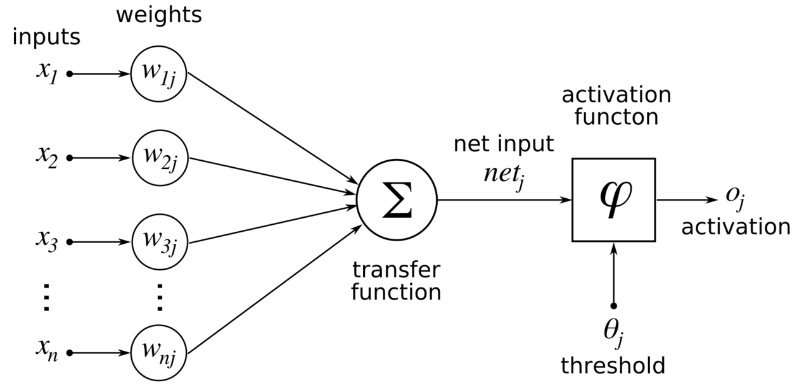

# Apprentissage supervisé

## Objectifs de l'apprentissage supervisé 

On considère un vecteur de variables ${\bf x} \in \mathbb{R}^D$ associé à une catégorie $y \in \{1, \dots, K\}$. L'objectif de l'apprentissage supervisé est de construire un modèle de prédiction probabiliste, $q({\bf x}, \theta)$, minimisant une fonction de perte moyenne.

Le modèle étant paramétré par un vecteur de coefficient $\theta$, le problème se résume à minimiser une fonction de $\theta$ 

$$
\hat \theta = \arg\min_{\theta} L(\theta) \, ,
$$

où


$$
  L(\theta) = \mathbb{E}[L(q({\bf x}, \theta), y)] \, .
$$


La valeur théorique de l'espérance étant difficile à calculer, la perte moyenne est généralement évaluée à partir d'un échantillon de données d'apprentissage $({\bf x}_i, y_i)$, $i = 1, \dots, n$, 

$$
   L(\theta) \approx \frac1n \sum_{i = 1}^n L(q({\bf x}_i, \theta), y_i) \, .
$$

L'ensemble d'apprentissage est utilisé pour calculer $\hat \theta$. Un ensemble de test est aussi utilisé pour évaluer les performances du modèle.

Pour simplifier la discussion, nous supposerons que les observations appartiennent à deux catégories $(K=2$), et nous notons les deux classes $y = 0$ ou $y = 1$.


## Réseaux de neurones

### Neurone probabiliste

Soit ${\bf x} \in \mathbb{R}^D$. On appelle _neurone probabiliste_ un prédicteur probabiliste de la forme suivante

$$
 q({\bf x}, \theta) =  {\rm sigmoid}( {\bf w}^T {\bf x}  - b ) \, , \quad  {\bf x} \in \mathbb{R}^D,
$$
où la fonction ${\rm sigmoid}$ est définie par 

$$
{\rm sigmoid}(x) = \frac{1}{1 + e^{-x}}\, , \quad  x \in \mathbb{R},
$$
et le paramètre $\theta$ possède $(D+1)$ coefficients

$$
\theta = (b, {\bf w}).
$$

Le vecteur de coefficients ${\bf w}$ est de dimension $D$ et $b$ est un scalaire représentant un seuil. 

La motivation initiale d'un modèle neuronal est d'imiter un neurone biologique. En effet, les variables ${\bf x}$ représentent des stimuli externes, les coefficients ${\bf w}$ représentent des poids synaptiques, et la fonction "sigmoid" correspond à la fonction d'activation d'un neurone biologique. Le neurone emet un signal binaire avec une probabilité d'autant plus grande que la somme pondérée des stimuli est grande. 

Nous remarquons que la notation peut être simplifiée en ajoutant une variable d'entrée $x_{0}$ fixée de manière constante à la valeur $-1$ ($x_{0} = -1$). Dans ce cas, nous pouvons augmenter la dimension du vecteur ${\bf w}$ à $D+1$, et prendre $w_0 = b$. La fonction de decision neuronale est alors décrite par la formule suivante

$$
 q({\bf x}, {\bf w}) =  {\rm sigmoid}( {\bf w}^T {\bf x} ) \, , \quad  {\bf x} \in \mathbb{R}^D.
$$

Le modèle neuronal précédent et sa version déterministe ([neurone formel](https://fr.wikipedia.org/wiki/Neurone_formel#Historique)) sont connus depuis les années 1950 sous le nom de [perceptron](https://en.wikipedia.org/wiki/Perceptron). L'intérêt pour les réseaux de neurones remonte en effete aux origines de l'informatique. 




### Interprétation non-biologique des neurones probabilistes

Nous avons rencontré des modèles probabilistes neuronaux à plusieurs reprises, et notamment lors du calcul de certains algorithmes d'apprentissage optimaux. Par exemple, la forme mathématique d'un neurone probabiliste est apparue naturellement lorsque l'on a cherché à séparer (discriminer) deux classes gaussiennes ayant la même structure de dépendance interne (covariance). Cette forme mathématique est aussi apparue dans des exemples de loi exponentielle. Elle est en fait liée aux lois de la famille exponentielle, aussi appelées _lois de Boltzmann_. 

**Loi de Boltzmann.** Remarquons qu'une loi de probabilité positive peut toujours être représentée sous la forme suivante 

$$
p({\bf x}) = \frac1Z e^{-h({\bf x})} \, , \quad  Z = \int e^{-h({\bf x})} d{\bf x} ,
$$
où $h({\bf x})$ est appelée la _fonction d'énergie_. La représentation naturelle de la loi $p({\bf x})$ consiste à choisir

$$
h({\bf x}) = -\log p({\bf x})  \, .
$$
Dans ce cas, nous avons $Z = 1$ et l'entropie $h(p)$ est égale à l'espérance de la fonction d'énergie $h(p) = \mathbb{E}[h(\bf x)]$ de la loi. 


Supposons les observations générées par la loi de densité $p_0({\bf x})$ si elles appartiennent à la classe $y = 0$ et par la loi $p_1({\bf x})$ si elles appartiennent à la classe $y = 1$ (les valeurs des densités sont strictement positives). 

Dans cette formulation générale, le prédicteur probabiliste optimal est décrit par la probabilité conditionnelle de la classe $(y=1)$ sachant ${\bf x}$
$$
 q_{\rm opt}({\bf x}) = p(y = 1 | {\bf x} )  \, . 
$$

D'après la formule de Bayes, nous avons

$$
q_{\rm opt}({\bf x}) = \frac{\pi_1p({\bf x}|y = 1)}{\pi_0p({\bf x}|y = 0) + \pi_1p({\bf x}|y = 1)} =  \frac{\pi_1p_1({\bf x)}}{\pi_0 p_0({\bf x}) + \pi_1 p_1({\bf x})} \, ,
$$
où l'on a posé $\pi_1 = p(y = 1)$ et $\pi_0 = p(y = 0)$. En utilisant la représentation de Boltzmann et en simplifiant cette expression, la fonction sigmoide apparaît naturellement de la manière suivante

$$
q_{\rm opt}({\bf x}) = {\rm sigmoid}(h_0({\bf x}) - h_1({\bf x}) - b_{01}) \, ,
$$
où $b_{01} = \log(\pi_0/\pi_1)$. Un prédicteur optimal est donc un prédicteur _neuronal_ si et seulement si la différence d'énergie peut être exprimée sous une forme affine

$$
 h_1({\bf x}) - h_0({\bf x}) = {\bf w}^T {\bf x} - b \, , \quad {\bf x} \in \mathbb{R}^D.
$$

Par exemple, supposons que les deux lois conditionnelles sont gaussiennes, de même matrice de covariance $C$ et de moyennes respectives $m_0$ et $m_1$. Nous pouvons poser  

$$
h_i({\bf x}) = h_C({\bf x} - {\bf m}_i) = ({\bf x} - {\bf m}_i)^T C^{-1} ({\bf x} - {\bf m}_i) \, , \quad i = 0,1. 
$$

Dans ce cas, nous verrons en travaux dirigés que la condition de linéarité précédente est vérifiée. En d'autres termes, dans le cas particulier de lois gaussiennes de même covariance, _un unique_ neurone suffit pour construire le prédicteur optimal.


### Réseaux de neurones multicouches

Dans une section précédente, nous avons découvert la forme générale d'un prédicteur optimal. Elle est donnée par la formule de Bayes  

$$
q_{\rm opt}({\bf x}) = {\rm sigmoid}(h_0({\bf x}) - h_1({\bf x}) - b_{01}) \, .
$$

La difficulté d'approcher ce prédicteur par une machine provient du fait que les fonctions d'énergie peuvent être complexes et caractérisées par de nombreux paramètres inconnus.  

Pour approcher un prédicteur optimal, l'idée générale est de construire une modèle de prédiction paramétrique permettant d'approcher le mieux possible l'expression apparaissant dans la sigmoide, 

$$
{\rm logit ~} q({\bf x}) = h_0({\bf x}) - h_1({\bf x}) - b_{01} \, , \quad {\bf x} \in \mathbb{R}^D.
$$

L'analyse mathématique cherche souvent à répondre à cette question en projetant la fonction  précédente sur des bases fonctionnelles particulières, par exemple des fonctions polynomiales, des fonctions trigonométriques, des splines, etc.

L'intelligence artificielle propose d'approcher le prédicteur optimal par des combinaisons de fonctions neuronales agencées en couches successives, comme dans le cerveau humain. L'idée n'est pas d'utiliser une base fonctionnelle particulière mais d'apprendre une base adaptable au problème considérée, afin d'utiliser les meilleures représentations des variables observées.

Par exemple, un réseau de neurones possédant une couche cachée s'écrit de la manière suivante

$$
 q({\bf x}, {\bf \theta}) = {\rm sigmoid}({\bf W_0}^T \, {\rm sigmoid}({\bf W_1}^T{\bf x}) ) \, .
$$

où le paramètre global, $\theta$, inclut les seuils d'activations et les coefficients synaptiques. Il correspond à la formule suivante
$$
\theta = ({\bf W_0}, {\bf W_1}).
$$

Les notations ${\bf W_0}^T$ et ${\bf W_1}^T$ désignent désormais des matrices de dimensions respectives $D \times L$ et $L\times 1$ et la fonction _sigmoide_ est appliquée à chaque coordonnée des vecteurs. Le paramètre $L$ correspond au nombre de neurones dans la couche cachée.  Le paramètre global $\theta$ est donc de dimension $(D + 2)L + 1$. Ainsi, pour deux dimensions ($D =2$) et 20 neurones, nous aurons 81 paramètres distincts dans le modèle. 

La formule peut se généraliser à plusieurs couches. On parle alors de réseaux multi-couches. On qualifie les réseaux multi-couches de _réseaux profonds_ à partir d'une douzaine de couches.  Par exemple, un réseau de neurones possédant 3 couches cachées s'écrit

$$
 q({\bf x}, {\bf \theta}) = {\rm sigmoid}( {\bf W_0}^T {\rm sigmoid}({\bf W_1}^T{\rm sigmoid}({\bf W_2}^T{\rm sigmoid}({\bf W_3}^T{\bf x})))) \, , \quad {\bf x} \in \mathbb{R}^D.
$$

Notons que la fonction sigmoide n'est pas la seule fonction d'activation proposée dans les réseaux neuronaux. La fonction _rectified linear unit_ (_relu_) est souvent utilisée pour son efficacité numérique. La fonction _relu_ est définie par

$$
{\rm relu}(x) = \max(0, x) , \, \quad x \in \mathbb{R}.
$$

Elle est parfois remplacée par la fonction _softplus_ définie de la manière suivante

$$
{\rm softplus}(x) = \log(1 + e^{x}), \, \quad x \in \mathbb{R}.
$$
Cette dernière correspond à la primitive de la fonction sigmoide.


### Un neurone, c'est peu, deux neurones c'est mieux. 

Supposer que la matrice de covariance $C$ est constante ou que les variables observées sont gaussiennes peut être très restrictif pour les applications de l'intelligence artificielle. Il est en effet très simple de trouver un exemple dans lequelle une frontière de decision linéaire serait sous-optimale. Dans ce cas, le prédicteur optimal $q({\bf x})$ ne pourra pas être représenté par un unique neurone probabiliste.


Pour illustrer ce cas, considèrons un jeu de données unidimensionel dans lequel la variable $x$ est uniformément répartie dans l'intervalle $(-2,2)$. La variable $x$ est dans la classe 1 (orange) avec la probabilité $\alpha$ et la classe 0 (bleue) avec la probabilité $1 - \alpha$ si elle se trouve dans l'intervalle $(-1,1)$. Si elle se trouve dans l'intervalle complémentaire, la variable $x$ est dans la classe 1 (orange) avec la probabilité $1 - \alpha$ et la classe 0 (bleue) avec la probabilité $\alpha$. Nous choisissons $\alpha \approx 1$. Il faut donc penser la classification comme étant quasi déterministe.  Pour cet exemple, nous souhaitons montrer que deux neurones sont necessaires (et suffisants) pour approcher la perte minimale de manière raisonnable.


#### Prédicteur optimal 

```{r cm5_pred_optimal}
# definition du taux alpha
  alpha <- 0.95

# echantillonner 100 points au hasard
  x <- runif(100, -2, 2)
  
# condition d'échantillonnage dans l'intervalle (-1,+1) 
  y <- x > -1  &  x < 1

# génération des classes 'bleue' ou 'orange'   
  cl <-  NULL
  cl[y] <- sample(c("blue","orange"), sum(y), prob = c(1-alpha, alpha), replace = TRUE)
  cl[!y] <- sample(c("blue","orange"), sum(!y), prob = c(alpha, 1-alpha), replace = TRUE)  

  plot(x, y, pch = 19, col = cl)
```

En tirant 100 variables selon le modèle probabiliste défini ci-dessus, nous voyons clairement que la frontière optimale est proche des points $x = -1$ et $x = +1$. La séparation des données à l'aide d'un point unique est optimale lorsque l'on classe les points $x < 1$ en orange. Dans ce cas, l'erreur  moyenne de classification (01-loss) est égale à

```{r}
mean((x < 1) != (cl == "orange"))
```

Lorsque l'on classe les points $x < 1$ en orange, l'erreur moyenne de classification peut aussi être calculée théoriquement. Dans ce cas, considérons la fonction $c(x) = 1$ ("orange") si $x < 1$ et $c(x) = 0$ ("bleu") sinon. Nous avons 


$$
p(y \neq c(x)) = \frac14 \int_{-2}^1 p(y=0|x)dx + \frac14 \int_{1}^2 p(y=1|x)dx  \, . 
$$

Dans la formule de conditionnement, la densité de la variable $x$ apparaît indirectement, puisqu'elle est constante et égale à 1/4. Le calcul des intégrales conduit au résultat suivant pour la valeur $\alpha = 0.95$

$$
p(y \neq c(x)) =  \frac14 (3 - 2\alpha) \approx  0.275 \, .
$$

Lorsque l'on classe les points $x \in (-1,+1)$ en orange, l'erreur moyenne de classification  peut aussi être calculée théoriquement et elle est égale à

$$
p(y \neq c_{\rm o}(x)) =  (1 - \alpha) \approx  0.05 \, .
$$

Pour déterminer le prédicteur probabiliste optimal, il suffit de calculer le rapport des densités de probabilité $p_0(x)/p_1(x)$, car les classes sont équiprobables. Nous avons

$$
p_0(x)/p_1(x) = \left\{ \begin{array}{cl} 2\alpha/(1-\alpha) & {\rm si~} x \in (-1,+1) \\  2(1-\alpha)/\alpha & {\rm sinon.} \end{array} \right. 
$$

Dans ce cas, nous voyons que la différence des termes d'énergie est proche de l'infini

$$
h_0(x) - h_1(x) = -\log(p_0(x)/p_1(x)) \approx_{\alpha \to 1} \left\{ \begin{array}{l} +\infty & {\rm si~} x \in (-1,+1) \\  -\infty & {\rm sinon.} \end{array} \right. 
$$
Le prédicteur probabiliste optimal est donné par la formule suivante 

$$
q_{\rm opt}(x) = \left \{ \begin{array}{l} 2\alpha/(1+\alpha) & {\rm si~} x \in (-1, 1)\\ 
 (1 - \alpha)/(1+\alpha)  & {\rm sinon.}  \\ \end{array} \right.
$$
Lorsque $\alpha$ est proche de 1, nous avons bien 
$$
q_{\rm opt}(x) \approx \left \{ \begin{array}{l} 1 & {\rm si~} x \in (-1, 1)\\ 
0 & {\rm sinon.}  \\ \end{array} \right.
$$

De même, l'espérance de la fonction de perte quadratique pour le prédicteur optimal est égale à (exercice)

$$
\mathbb{E}[ (y - q_{\rm opt}(x))^2] = \frac{\alpha(1-\alpha)}{(2-\alpha)^2} \, ,
$$
et le risque moyen tend vers zéro lorsque $\alpha$ tend vers 1 (ou vers zéro). D'autres valeurs de perte moyenne pourraient ainsi être calculées de manière similaire. 

#### Approximation par un réseau à deux neurones

Pour le problème d'apprentissage étudié ci-dessus, nous souhaitons montrer que le prédicteur optimal calculé précédemment peut être approché par un réseau de neurones très simple. Considérons, à cet effet, la fonction suivante

$$
I_{\epsilon} (x) = {\rm sigmoid}\left(\frac{1-x}\epsilon\right) + {\rm sigmoid}\left(\frac{1+x}\epsilon\right) - 1  \, , \quad x \in (-2,2). 
$$

Cette fonction est construite à partir de deux fonctions de décision neuronales. Elle permet approcher arbitrairement (au sens $L^2$ par exemple) la fonction indicatrice de l'intervalle $(-1,+1)$.

```{r cm5_approx_nnet, echo = FALSE}
  sigmoid <- function(x) 1/(1+exp(-x))

  I_eps <- function(x, epsilon = 0.01){ 
            sigmoid((1-x)/epsilon) + sigmoid((x+1)/epsilon) - 1
    }
  
  x <-  seq(-2,2,length = 400)
  plot(x, I_eps(x), type = "l", lwd = 2, col = "orange", main ="epsilon = 0.01")
```


Nous pouvons alors approcher le prédicteur optimal, $q_{\rm opt}(x)$ de la façon suivante

$$
q_{\rm opt}(x) \approx {\rm sigmoid}\left( {\rm logit}\left( \frac{2\alpha}{2-\alpha} \right) I_{\epsilon}(x) 
+ {\rm logit}\left(\frac{2(1-\alpha)}{2-\alpha} \right) (1 - I_{\epsilon}(x))  \right) \,.
$$

En réorganisant les termes, nous obtenons que 

$$
q_{\rm opt}(x) \approx {\rm sigmoid}\left(  w_1(\alpha) {\rm sigmoid}\left(\frac{1-x}\epsilon\right) + w_2(\alpha) {\rm sigmoid}\left(\frac{1+x}\epsilon\right)
- b(\alpha)  \right) \,.
$$
Ainsi, le prédicteur optimal peut être réalisé par un réseau de neurones ayant une couche cachée, et deux neurones dans cette couche. Les coefficients dépendent de la valeur $\alpha$ considérée dans le modèle génératif, et $\epsilon$ tend vers zéro. 


### Approximation universelle

La justification mathématique des réseaux de neurones est abstraite. On peut mentionner que théorèmes d'approximation universelle ont été établis afin de démontrer qu'une fonction suffisamment régulière peut être approchée de manière arbitraire par un prédicteur neuronal. Ces résultats ressemblent au célèbre théorème d'approximation de [Weierstrass](https://fr.wikipedia.org/wiki/Th%C3%A9or%C3%A8me_de_Stone-Weierstrass).

Les résultats théoriques ne contiennent pas de construction pratique de l'approximation d'un prédicteur arbitraire par un réseau de neurones. Une idée de preuve a été donnée dans la section précédente pour l'indicatrice d'un intervalle. Le principe peut être généralisé de la manière suivante.

Considérons la fonction ${\rm logit}(q(x))$ où $q(x)$ est une fonction absolument continue de l'intervalle $(a,b)$. La fonction $f(x) = {\rm logit}(q(x))$ peut être approchée par une fonction constante par morceau

$$
f(x) \approx \sum_{i = 1}^N f(x_i) \mathbb{1}_{(x_{i-1}, x_{i})} (x) \, , \quad x_i = a + i(b-a)/N
$$
Les fonctions indicatrices d'intervalle peuvent être approchées par des fonctions neuronales comportant deux neurones et un seuil (à construire sur le modèle de la fonction $I_{\epsilon}$). Nous voyons ainsi que la fonction $q(x)$ peut être approchée par un réseau de neurones conportant une unique couche cachée et $2N$ neurones. 


## Gradient stochastique

### Principe

En général, nous ne connaissons pas le modèle génératif des variables observées et, même lorsque un modèle est supposé les expliquer, la valeur théorique de l'espérance est difficile à calculer. 
En pratique, la perte moyenne est évaluée de manière empirique à partir d'observations $({\bf x}_i, y_i)$, $i = 1, \dots, n$, réparties dans un échantillon d'apprentissage (ou dans un échantillon de test)

$$
   L(\theta) \approx \frac1n \sum_{i = 1}^n L(q({\bf x}_i, \theta), y_i) \, .
$$

L'apprentissage est généralement réalisé par une méthode d'optimisation numérique. Il existe de nombreuses méthodes d'optimisation numérique permettant de trouver un minimum local de la fonction $L(\theta)$. 

La méthode de prédilection des réseaux de neurones est la méthode du gradient. Il s'agit d'une méthode rudimentaire cherchant à suivre la ligne de plus grande pente afin de minimiser la fonction objectif $L(\theta)$. Il s'agit d'une méthode d'optimisation locale.

La méthode du gradient repose sur le calcul des dérivées partielles de la fonction $L(\theta)$

$$
\nabla L = \left( \frac{\partial L}{\partial \theta_1} , \dots, \frac{\partial L}{\partial \theta_m} \right) \,.
$$

La méthode de gradient classique est une méthode itérative qui met à jour le paramètre $\theta$ de la manière suivante 

$$
\theta_{t+1} = \theta_t - \eta \nabla L(\theta_t) 
$$

où la constante $\eta$ est appelé _taux d'apprentissage_ (learning rate). Cette méthode peut être raffinée lorsque le paramètre $\theta$ est de dimension raisonnable, de l'ordre de quelques dizaines de coefficients. 

Les méthodes de _gradient stochastique_ sont utilisées en très grande dimension. Elles implémentent l'algorithme suivant

1. Choisir une valeur initiale $\theta$ et une valeur du taux d'apprentissage  $\eta$.
2. Répéter les étapes suivantes jusqu'à ce qu'un minimum acceptable soit atteint
- permuter aléatoirement les éléments de l'échantillon d'apprentissage
- pour tout $i$ de 1 à $n$, mettre à jour les paramètres
$$
\theta_{t+1} = \theta_{t+1} - \eta  \nabla L(q({\bf x}_i , \theta_t), y_i) 
$$

Un tel cycle aléatoire s'appelle une _époque_. La phase d'initialisation est une phase cruciale dans les applications. Pour la reconnaissance des images, de nombreux réseaux de neurones pré-entrainés existent et atteignent d'excellentes performances de classification une base de données publiques appelée "Imagenet". Les logiciels actuels permettent de récupérer les matrices des coefficients de réseaux pré-entrainés, simplifiant considérablement la phase d'initialisation d'un réseau de neurones destiné à reconnaître des images particulières, proche de celles annotées dans la base. On peut, en quelques heures, entraîner un réseaux de neurones à reconnaître des animaux domestiques à partir de quelques milliers d'images. Construire et entraîner un tel réseau sans cette condition initiale peut nécessiter des ressources considérables.       

Un compromis entre l'algorithme de gradient et l'algorithme de gradient stochastique consiste à considérer des paquets ("batch") de données lors de la mise à jour des paramètres. Cette technique est plus rapide que de passer en revue les membres de l'échantillon les uns après les autres comme dans le point 2 de l'algorithme.

L'algorithme de gradient stochastique s'accompagne de conditions concernant le taux d'apprentissage. Ce paramètre  de l'algorithme peut décroître avec le temps. Une condition classique consiste à choisir $\eta_t$ tel que
$$
\sum_{t=1}^\infty \eta_t = \infty \quad {\rm et } \quad \sum_{t=1}^\infty \eta_t^2 < \infty.
$$
De nombreuses variantes des algorithmes d'optimisation sont disponibles dans les programmes de réseaux de neurones et il est utile de pouvoir en tester plusieurs.


### Retropropagation du gradient

Avec des réseaux de neurones multicouches, le calcul du gradient de la fonction de perte prend une forme particulière, directement liée à la dérivation des fonctions composées. 

Comme pour un algorithme de programmation dynamique, il est pertinent de procéder par récurrence en calculant les dérivées de la fonction d'erreur dans l'ordre inverse des couches. Cela donne le célèbre algorithme de _retropropagation de l'erreur_. 

Pour comprendre l'algorithme sans avoir à détailler des notations malcommodes, plaçons nous dans le cas irréaliste d'un réseau à une couche cachée, constituée d'un neurone unique et sans biais. Nous considérons alors le prédicteur suivant 

$$
 q(x,w_0,w_1) = {\rm sigmoid}( w_0{\rm sigmoid}( w_1 x )) \, , \quad x \in \mathbb{R} ,
$$
 ainsi que l'erreur quadratique moyenne associée à ce prédicteur

$$
L(w_0,w_1) = \mathbb{E}[(y - q(x, w_0, w_1))^2] .
$$

Dans ce cas, nous avons $\theta = (w_0,w_1)$ et il n'y a que deux paramètres à ajuster. Pour calculer le gradient de l'erreur, dérivons d'abord par rapport à $w_0$. Nous obtenons le résultat suivant

$$
\frac{\partial L}{\partial w_0} = 2 \, {\rm sigmoid} (w_1 x)  \, q(x, w_0, w_1) \, ( 1 - q(x, w_0, w_1)) \, \mathbb{E}[y - q(x, w_0, w_1)]  \, .
$$
Dérivons ensuite $L(\theta)$ par rapport à $w_1$. Nous obtenons le résultat suivant

$$
\frac{\partial L}{\partial w_1} = (1 - {\rm sigmoid} (w_1 x)) \frac{\partial L}{\partial w_0} \, .
$$
Ainsi, nous voyons que le calcul de la dérivée correspondant à la couche de sortie ($w_0$) peut être "rétropropagée" à la couche antérieure ($w_1$). Lorsqu'il y a plus de neurones et de couches, les calculs se généralisent suivant le même principe de rétropropagation.


### Critère d'optimisation et régularisation

L'utilisation d'un réseau de neurones suppose que l'on a correctement fixé un certain nombre de paramètres du modèle a priori, comme le nombre de couches cachées, le nombre de neurones par couche cachée, le taux d'apprentissage, la taille des paquets pour le "batch", etc.

Ces paramètres sont généralement choisi en évaluant le réseau sur un ensemble test après la phase d'apprentissage. Le jeu de paramètre minimisant la fonction de perte sur l'ensemble test pourra alors être retenu pour effectuer les prédiction pour des données futures. 

Afin d'éviter de choisir le nombre de neurones par couche cachée, on introduit souvent un paramètre de régularisation, $\lambda >0$. Il y a de nombreuses possibilités pour introduire des régularisations dans un réseau de neurones. La plupart des logiciels implémente la régularisation _ridge_ dans la fonction de perte pénalisée suivante 

$$
   L(\theta) = \frac1n \sum_{i = 1}^n L(q({\bf x}_i, \theta), y_i)  + \lambda \| \theta \|_2^2 \, .
$$


Dans les réseaux profonds, on utilise la chirurgie neuronale (Dropout), consistant à éteindre un pourcentage de neurones aléatoirement. À completer.


## Exemples réels MNIST, IMBD, Imagenet 

Plusieurs exemples seront étudiées en TDs et en TPs, notamment grâce aux biliothèques R _nnet_, _keras_ et son interface avec le programme de Google _tensorflow_.


## Principales notions à retenir

* Un neurone formel est une fonction mathématique permettant de calculer une valeur entre 0 et 1 en effectuant la somme pondérée de variables d'entrée, puis en effectuant une transformation sigmoidale.

* Les neurones formels apparaîssent naturellement lorsque l'on calcule le prédicteur optimal dans des structures exponentielles (lois de Boltzmann). Il sont liés à la **formule de Bayes**.

* Les réseaux de neurones peuvent séparer des classes de manière non-linéaire. En théorie, il est possible de résoudre tous les problèmes de classification avec des réseaux de neurones (approximation universelle).

* Les réseaux de neurones peuvent être ajustés par un algorithme de gradient stochastique et la méthode de rétropropagation du gradient. Le choix des paramètres liés à la complexité du réseau se fait en évaluant la fonction de perte sur l'ensemble de test.


