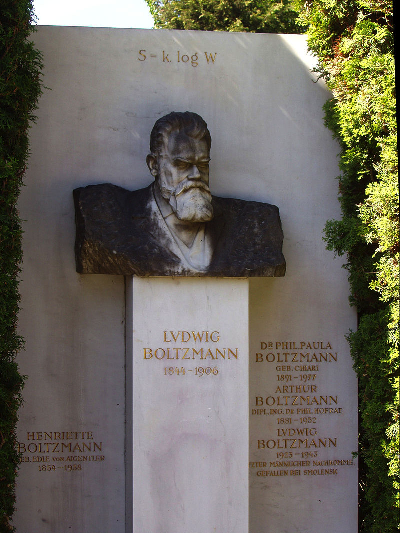

# Apprentissage supervisé

## Objectifs de l'apprentissage supervisé 

On considère un vecteur de variables ${\bf x} \in \mathbb{R}^D$ associé à une catégorie $y \in \{1, \dots, K\}$. L'objectif de l'apprentissage supervisé est de construire un prédicteur probabiliste, $q({\bf x}, \hat \theta)$, paramétrée par un vecteur de coefficient $\theta$ minimisant le risque moyen

$$
\hat \theta = \arg\min_{\theta} L(\theta) \, , \quad {\rm où} \quad   L(\theta) = \mathbb{E}[L(y, q({\bf x}, \theta))] \, .
$$
La valeur théorique de l'espérance étant difficile à calculer, le risque moyen est généralement évalué à partir d'échantillons $({\bf x}_i, y_i)$, $i = 1, \dots, n$, répartis en ensembles d'apprentissage et de test

$$
   L(\theta) \approx \frac1n \sum_{i = 1}^n L(y_i, q({\bf x}_i, \theta)) \, .
$$
Pour simplifier, nous supposerons uniquement deux catégories $(K=2$), et nous numérotons les deux classes $y = 0,1$.


## Réseaux de neurones

### Neurone probabiliste

Soit ${\bf x} \in \mathbb{R}^D$. On appelle _neurone probabiliste_ un prédicteur probabiliste de la forme suivante

$$
 q({\bf x}, \theta) =  {\rm sigmoid}( {\bf w}^T {\bf x}  - b ) \, , \quad  {\bf x} \in \mathbb{R}^D,
$$
où la fonction ${\rm sigmoid}$ est définie par 

$$
{\rm sigmoid}(x) = \frac{1}{1 + e^{-x}}\, , \quad  x \in \mathbb{R},
$$
et

$$
\theta = (b, {\bf w}).
$$

Le vecteur de coefficients ${\bf w}$ est de dimension $D$ et $b$ est un scalaire représentant un seuil. La motivation initiale d'un tel modèle est d'imiter un neurone biologique. En effet, les variables ${\bf x}$ représentent des stimuli externes, les coefficients ${\bf w}$ représentent des poids synaptiques, et la fonction sigmoid correspond à la fonction d'activation d'un neurone biologique. Le neurone un signal avec une probabilité d'autant plus grande que la somme pondérée des stimuli est grande. 

Nous remarquons que la notation peut être simplifiée en ajoutant une variable d'entrée $x_{0}$ fixée de manière constante à la valeur $-1$ ($x_{0} = -1$). Dans ce cas, nous pouvons augmenter la dimension du vecteur ${\bf w}$ à $D+1$, et prendre $w_0 = b$. La fonction de decision neuronale est alors décrite par la formule suivante

$$
 q({\bf x}, {\bf w}) =  {\rm sigmoid}( {\bf w}^T {\bf x} ) \, , \quad  {\bf x} \in \mathbb{R}^D.
$$
Ce modèle est connu depuis les années 1950 sous le nom de _perceptron_, et les perceptrons ont fait partie des premiers algorithmes programmés par des ordinateurs.


### Interprétation non-biologique des neurones (information)

Nous avons rencontré des prédicteurs probabilistes neuronaux à plusieurs reprises, et notamment lors du calcul de certaines machines d'apprentissage optimales. Par exemple, la forme neuronale est apparue naturellement lorsque l'on a cherché à séparer (discriminer) deux classes gaussiennes ayant même structure de dépendance interne (covariance) ou de classes de loi exponentielle. 

Remarquons qu'une loi de probabilité positive peut toujours être représentée sous la forme suivante (loi de Boltzmann)

$$
p({\bf x}) = \frac1Z e^{-h({\bf x})} \, , \quad  Z = \int e^{-h({\bf x})} d{\bf x} ,
$$
où $h({\bf x})$ est appelée la _fonction d'énergie_. La représentation naturelle de la loi $p({\bf x})$ est loi de Boltzmann consiste à choisir

$$
h({\bf x}) = -\log p({\bf x})  \, .
$$
Dans ce cas, nous avons $Z = 1$ et l'entropie $h(p)$ est égale à l'energie moyenne $h(p) = \mathbb{E}[h(\bf x)]$ de la loi. 




Supposons que des données ont été générées par la loi $p_0({\bf x})$ si elles appartiennent à la classe $y = 0$ et par la loi $p_1({\bf x})$ si elles appartiennent à la classe $y = 1$. Dans cette formulation générale, le prédicteur probabiliste optimal est donné par la formule de Bayes

$$
q_{\rm opt}({\bf x}) = \frac{\pi_1p({\bf x}|y = 1)}{\pi_0p({\bf x}|y = 0) + \pi_1p({\bf x}|y = 1)} =  \frac{\pi_1p_1({\bf x)}}{\pi_0 p_0({\bf x}) + \pi_1 p_1({\bf x})} \, ,
$$
où l'on a posé $\pi_1 = p(y = 1)$ et $\pi_0 = p(y = 0)$. En utilisant la représentation de Boltzmann et en simplifiant cette expression, la fonction sigmoide apparaît naturellement de la manière suivante

$$
q_{\rm opt}({\bf x}) = {\rm sigmoid}(h_0({\bf x}) - h_1({\bf x}) - b_{01}) \, ,
$$
où $b_{01} = \log(\pi_0/\pi_1)$. Un prédicteur optimal est donc _neuronal_ si et seulement si la difference d'énergie peut être exprimée sous une forme affine

$$
 h_1({\bf x}) - h_0({\bf x}) = {\bf w}^T {\bf x} - b \, , \quad {\bf x} \in \mathbb{R}^D.
$$

Supposons par exemple que les lois conditionnelles sont gaussiennes, de matrice de covariance $C$ et de moyennes respectives $m_0$ et $m_1$. Dans ce cas, la condition de linéarité est vérifiée car nous avons  

$$
h_i({\bf x}) = h_C({\bf x} - {\bf m}_i) = ({\bf x} - {\bf m}_i)^T C^{-1} ({\bf x} - {\bf m}_i) \, , \quad i = 0,1. 
$$

En d'autres termes, dans le cas particulier de loi gaussienne de covariance $C$, _un unique_ neurone suffit pour construire le prédicteur optimal.


### Réseaux de neurones multicouches

Dans une section précédente, nous avons découvert la forme générale d'un prédicteur optimal. Elle est donnée par la formule de Bayes  

$$
q_{\rm opt}({\bf x}) = {\rm sigmoid}(h_0({\bf x}) - h_1({\bf x}) - b_{01}) \, .
$$

La difficulté d'approcher ce prédicteur par une machine provient du fait que les fonctions d'énergie peuvent être arbitrairement complexes, non-linéaires, et caractérisées de nombreux paramètres inconnus.  

Pour approcher un prédicteur optimal, l'idée générale est de construire une machine paramétrique (une fonction de prédiction) permettant d'approcher le mieux possible l'expression apparaissant dans l'inverse de la sigmoide, appelée fonction $\logit$, 

$$
{\rm logit ~} q({\bf x}) = h_0({\bf x}) - h_1({\bf x}) - b_{01} \, , \quad {\bf x} \in \mathbb{R}^D.
$$

L'analyse fonctionnelle permet de répondre à cette question en projetant cette fonction sur des bases fonctionnelles particulières, par exemple des fonctions polynomiales, des fonctions trigonométriques, des splines, etc.

L'intelligence artificielle propose d'approcher le prédicteur optimal par des combinaisons de fonctions neuronales agencées en couches successives, comme dans le cerveau humain. L'idée n'est pas d'utiliser une base particulière mais d'apprendre une base adaptée, afin d'utiliser les meilleures représentations des variables observées.

Par exemple, un réseau de neurones possédant une couche cachée s'écrit

$$
 q({\bf x}, {\bf \theta}) = {\rm sigmoid}({\bf W_0}^T {\rm sigmoid}({\bf W_1}^T{\bf x}) ) \, .
$$

où le paramètre global, $\theta$, à été augmenté pour inclure tous les seuils d'activations et correspondre à 
$$
\theta = ({\bf W_0}, {\bf W_1}).
$$

Les notations ${\bf W_1}^T$ et ${\bf W_0}^T$ désignent désormais des matrices de dimensions respectives $D \times L$ et $L\time 1$ et la fonction _sigmoid_ est appliquée à chaque coordonnée des vecteurs. Le paramètre $L$ correspond au nombre de neurones dans la couche cachée.  Le paramètre global $\theta$ est donc de dimension $(D + 2)L + 1$. Ainsi, pour deux dimensions ($D =2$) et 20 neurones, nous aurons 81 paramètres distincts dans le modèle. 

La formule peut se généraliser à plusieurs couches. On parle alors de réseaux multi-couches. On qualifie les réseaux multi-couches de _réseaux profonds_ à partir d'une douzaine de couches.  Par exemple, un réseau de neurones possédant 3 couches cachées s'écrit

$$
 q({\bf x}, {\bf \theta}) = {\rm sigmoid}( {\bf W_0}^T {\rm sigmoid}({\bf W_1}^T{\rm sigmoid}({\bf W_2}^T{\rm sigmoid}({\bf W_3}^T{\bf x})))) \, , \quad {\bf x} \in \mathbb{R}^D.
$$

Notons que la fonction sigmoide n'est pas la seule fonction d'activation proposée dans les réseaux neuronaux. La fonction _rectified linear unit_ (_relu_) est souvent utilisée pour son efficacité numérique. La fonction _relu_ est définie par

$$
{\rm relu}(x) = \max(0, x) , \, \quad x \in \mathbb{R}.
$$

Elle est parfois remplacée par la fonction _softplus_ définie de la manière suivante

$$
{\rm softplus}(x) = \log(1 + e^{x}), \, \quad x \in \mathbb{R}.
$$
Cette dernière correspond à la primitive de la fonction sigmoide.


### Un neurone, c'est peu, deux neurones c'est mieux. 

Supposer que la matrice de covariance $C$ est constante ou que les variables observées sont gaussiennes peut être très restrictif pour les applications de l'intelligence artificielle. Il est en effet très simple de trouver un exemple dans lequelle une frontière de decision linéaire serait sous-optimale. Dans ce cas, le prédicteur optimal $q({\bf x})$ ne pourra pas être représenté par un unique neurone probabiliste.


Pour illustrer ce cas, considèrons un jeu de données unidimensionel dans lequel la variable $x$ est uniformément répartie dans l'intervalle $(-2,2)$. La variable $x$ est dans la classe 1 (orange) avec la probabilité $\alpha$ et la classe 0 (bleue) avec la probabilité $1 - \alpha$ si elle se trouve dans l'intervalle $(-1,1)$. Si elle se trouve dans l'intervalle complémentaire, la variable $x$ est dans la classe 1 (orange) avec la probabilité $1 - \alpha$ et la classe 0 (bleue) avec la probabilité $\alpha$. Il faut penser que la classification est quasi déterministe $\alpha \approx 1$.  Pour cet exemple, nous souhaitons montrer que deux neurones sont necessaires (et suffisants) pour approcher le risque minimal de manière raisonnable.


```{r}
# definition du taux alpha
  alpha <- 0.95

# echantillonner 100 points au hasard
  x <- runif(100, -2, 2)
  
# condition d'échantillonnage dans l'intervalle (-1,+1) 
  y <- x > -1  &  x < 1
  
  cl <-  NULL
  cl[y] <- sample(c("blue","orange"), sum(y), prob = c(1-alpha, alpha), replace = TRUE)
  cl[!y] <- sample(c("blue","orange"), sum(!y), prob = c(alpha, 1-alpha), replace = TRUE)  

  plot(x, y, pch = 19, col = cl)
```

En tirant 100 variables selon le modèle probabiliste défini ce-dessus, nous voyons clairement que la frontiére optimale est proche des points $x = -1$ et $x = +1$. La séparation des données à l'aide d'un point unique est optimale lorsque l'on classe les points $x < 1$ en orange. Dans ce cas, l'erreur de classification moyenne (01-loss) est égale à

```{r}
mean((x < 1) != (cl == "orange"))
```

Lorsque l'on classe les points $x < 1$ en orange, l'erreur de classification moyenne peut être calculée théoriquement

$$
p(y \neq f(x)) = \frac14 \int_{-2}^1 p(y=0|x)dx + \frac14 \int_{1}^2 p(y=1|x)dx  \, . 
$$
Le calcul conduit au résultat suivant (calculé pour la valeur $\alpha = 0.95$)

$$
p(y \neq f(x)) =  \frac14 (3 - 2\alpha) \approx  0.275 \, .
$$

Lorsque l'on classe les points $x \in (-1,+1)$ en orange, l'erreur de classification moyenne peut aussi être calculée théoriquement et elle est égale à

$$
p(y \neq f(x)) =  (1 - \alpha) \approx  0.05 \, .
$$

Pour déterminer le prédicteur probabiliste optimal, il suffit de calculer le rapport des densités de probabilité $p_0(x)/p_1(x)$, car les classes sont équiprobables. Nous avons

$$
p_0(x)/p_1(x) = \left\{ \begin{array}{cl} 2\alpha/(1-\alpha) & {\rm si~} x \in (-1,+1) \\  2(1-\alpha)/\alpha & {\rm sinon.} \end{array} \right. 
$$

Dans ce cas, nous voyons que la différence des termes d'énergie est proche de l'infini

$$
h_0(x) - h_1(x) = -\log(p_0(x)/p_1(x)) \approx_{\alpha \to 1} \left\{ \begin{array}{l} +\infty & {\rm si~} x \in (-1,+1) \\  -\infty & {\rm sinon.} \end{array} \right. 
$$
Le prédicteur probabiliste optimal est donné par la formule suivante 

$$
q_{\rm opt}(x) = \left \{ \begin{array}{l} 2\alpha/(1+\alpha) & {\rm si~} x \in (-1, 1)\\ 
 (1 - \alpha)/(1+\alpha)  & {\rm sinon.}  \\ \end{array} \right.
$$
Lorsque $\alpha$ est proche de 1, nous avons bien 
$$
q_{\rm opt}(x) \approx \left \{ \begin{array}{l} 1 & {\rm si~} x \in (-1, 1)\\ 
0 & {\rm sinon.}  \\ \end{array} \right.
$$

De même, l'espérance de la fonction de perte quadratique pour le prédicteur optimal est égale à (exercice)

$$
\mathbb{E}[ (y - q_{\rm opt}(x))^2] = \frac{\alpha(1-\alpha)}{(2-\alpha)^2} .
$$
et le risque moyen tend vers $zéro$ lorsque $\alpha$ tend vers 1 (ou vers zéro). D'autres valeurs de risque moyen pourraient ainsi être calculées de la même manière. 


Nous souhaitons montrer, pour ce problème d'apprentissage, que le prédicteur optimal peut être approché par un modèle de réseau de neurones très simple. Considérons en effet la fonction suivante

$$
I_{\epsilon} (x) = {\rm sigmoid}\left(\frac{1-x}\epsilon\right) + {\rm sigmoid}\left(\frac{1+x}\epsilon\right) - 1  \, , \quad x \in (-2,2). 
$$

Cette fonction est construite à partir de deux fonctions de décision neuronales. Elle permet approcher arbitrairement (au sens $L^2$ par exemple) la fonction indicatrice de l'intervalle $(-1,+1)$.

```{r, echo = FALSE}
  sigmoid <- function(x) 1/(1+exp(-x))

  I_eps <- function(x, epsilon = 0.01){ 
            sigmoid((1-x)/epsilon) + sigmoid((x+1)/epsilon) - 1
    }
  
  x <-  seq(-2,2,length = 400)
  plot(x, I_eps(x), type = "l", lwd = 2, col = "orange", main ="epsilon = 0.01")
```


Nous pouvons alors approcher le prédicteur optimal, $q_{\rm opt}(x)$ de la façon suivante

$$
q_{\rm opt}(x) \approx {\rm sigmoid}\left( {\rm logit}\left( \frac{2\alpha}{2-\alpha} \right) I_{\epsilon}(x) 
+ {\rm logit}\left(\frac{2(1-\alpha)}{2-\alpha} \right) (1 - I_{\epsilon}(x))  \right) \,.
$$

En réorganisant les termes, nous obtenons que 

$$
q_{\rm opt}(x) \approx {\rm sigmoid}\left(  w_1(\alpha) {\rm sigmoid}\left(\frac{1-x}\epsilon\right) + w_2(\alpha) {\rm sigmoid}\left(\frac{1+x}\epsilon\right)
- b(\alpha)  \right) \,.
$$
Ainsi, le prédicteur optimal peut être réalisé par un réseau de neurones ayant une couche cachée, et deux neurones dans cette couche. Les coefficients dépendent de la valeur $\alpha$ considérée dans le modèle génératif, et $\epsilon$ tend vers zéro. 


### Approximation universelle

La justification mathématique des réseaux de neurones est abstraite. On peut mentionner que théorèmes d'approximation universelle ont été établis afin de démontrer qu'une fonction suffisamment régulière peut être approchée de manière arbitraire par un prédicteur neuronal.

Les résultats théoriques ne contiennent pas de construction pratique de l'approximation d'un prédicteur arbitraire par un réseau de neurone. Une idée de la preuve a été donnée dans la section précédente. Le principe peut être généralisé de la manière suivante.

Considérons la fonction ${\rm logit}(q(x))$ où $q(x)$ est une fonction absolument continue de l'intervalle $(a,b)$. La fonction $f(x) = {\rm logit}(q(x))$ peut être approchée par une fonction constante par morceau

$$
f(x) \approx \sum_{i = 1}^N f(x_i) \mathbb{1}_{(x_{i-1}, x_{i})} (x) \, , \quad x_i = a + i(b-a)/N
$$
Les fonctions indicatrices d'intervalles peuvent être approchées par des fonctions neuronales comportant deux neurones et un seuil (à construire sur le modèle de la fonction $I_{\epsilon}$). Nous voyons ainsi que la fonction $q(x)$ peut être approchée par un réseau de neurones conportant une unique couche cachée et $2N$ neurones. 


## Gradient stochastique

### Principe

En général, nous ne connaissons pas le modèle génératif des variables observées et, même lorsque un modèle est supposé les expliquer, la valeur théorique de l'espérance est difficile à calculer. 
En pratique, le risque moyen est généralement évalué de manière empirique à partir d'observations $({\bf x}_i, y_i)$, $i = 1, \dots, n$, répartis en échantillons d'apprentissage et de test

$$
   L(\theta) \approx \frac1n \sum_{i = 1}^n L(y_i, q({\bf x}_i, \theta)) \, .
$$

L'apprentissage est réalisé par une méthode d'optimisation numérique. La méthode de prédilection des réseaux de neurones est la méthode du gradient (stochastique). Il s'agit d'une méthode rudimentaire cherchant à suivre la ligne de plus grande pente afin de minimiser la fonction objectif $L(\theta)$. Il s'agit d'une méthode d'optimisation locale.

La méthode du gradient repose sur le calcul des dérivées de la fonction $L(\theta)$

$$
\nabla L = \left( \frac{\partial L}{\partial \theta_1} , \dots, \frac{\partial L}{\partial \theta_m} \right) \,.
$$

Une méthode de gradient classique est une méthode itérative qui met à jour le paramètre $\theta$ de la manière suivante 

$$
\theta_{t+1} = \theta_t - \eta \nabla L(\theta_t) 
$$

où la constante \eta$ est appelé _taux d'apprentissage_ (learning rate). Cette méthode peut être utilisée, et même raffinée lorsque le paramètre $\theta$ est de dimension ($m$) raisonnable, de l'ordre de quelques dizaines. 

Les méthodes de _gradient stochastique_ sont utilisées en très grande dimension. Elles implémentent l'algorithme suivant

1. Choisir une valeur initiale $\theta$ et une valeur du taux d'apprentnissage 
2. Répéter les étapes suivantes jusqu'à ce qu'un minimum acceptable soit atteint
- permuter aléatoirement les éléments de l'échantillon d'apprentissage
- pour tout $i$ de 1 à $n$, mettre à jour les paramètres
$$
\theta_{t+1} = \theta_{t+1} - \eta  \nabla L(y_i, q({\bf x}_i , \theta_t)) 
$$
Un tel cycle aléatoire s'appelle une _époque_. La phase d'initialisation peut être une phase cruciale dans les applications. Pour la reconnaissance des images, de nombreux réseaux de neurones pré-entrainés existent et atteignent d'excellentes performances de classification sur la base de données Imagenet. Les logiciels actuels permettent de récupérer les matrices de coefficients de réseaux pré-entrainés, simplifiant considérablement la phase d'initialisation d'un réseau de neurone destiné à reconnaître des images particulières.    

Un compromis entre l'algorithme de gradient et l'algorithme de gradient stochastique consiste à considérer des paquets ("batch") lors de la mise à jour des paramètres plutôt que de passer en revue les membres de l'échantillon isolément les unes après les autres.

L'algorithme s'accompagne de plus de conditions pour que le pas de l'algorithme décroissent avec le temps. Une condition classique consiste à choisir $\eta_t$ tel que
$$
\sum_{t=1}^\infty \eta_t = \infty \quad {\rm et } \quad \sum_{t=1}^\infty \eta_t^2 < \infty.
$$
De nombreuses variantes des algorithmes d'optimisation sont disponibles dans les programmes de réseaux de neurones et il est utile de pouvoir en tester plusieurs.


### Retropropagation du gradient

Avec des réseaux de neurones multicouches, le calcul du gradient de la fonction de perte prend une forme particulière, directement liée à la dérivation des fonctions composées. 

Comme pour un algorithme de programmation dynamique, il est pertinent de procéder par récurrence en calculant les dérivées de la fonction d'erreur dans l'ordre inverse des couches. Cela donne le célèbre algorithme de retropropagation de l'erreur (qui n'est rien d'autre que le calcul des dérivées). 

Pour comprendre l'algorithme sans détailler des notations malcommodes, plaçons nous dans le cas irréaliste d'un réseau à une couche cachée, constituée d'un neurone unique et sans biais. Nous considérons le prédicteur suivant 

$$
 q(x,w_0,w_1) = {\rm sigmoid}( w_0{\rm sigmoid}( w_1 x )) \, , \quad x \in \mathbb{R}.
$$
ainsi que l'erreur quadratique moyenne associée à ce prédicteur

$$
L(w_0,w_1) = \mathbb{E}[(y - q(x, w_0, w_1))^2] .
$$

Pour calculer le gradient de l'erreur, dérivons d'abord par rapport à $w_0$

$$
\frac{\partial L}{\partial w_0} = 2 \, {\rm sigmoid} (w_1 x)  \, q(x, w_0, w_1) \, ( 1 - q(x, w_0, w_1)) \, \mathbb{E}[y - q(x, w_0, w_1)]  \, .
$$
Dérivons ensuite par rapport à $w_1$. Nous obtenons

$$
\frac{\partial L}{\partial w_1} = (1 - {\rm sigmoid} (w_1 x)) \frac{\partial L}{\partial w_0} \, .
$$
Ainsi, nous voyons que la dérivée peut être "rétropropagée" à la couche antérieure. Les calculs se généralisent lorsqu'il y a plus de neurones et de couches, suivant le même principe de rétropropagation.


### Critère d'optimisation et régularisation


* Fonction de perte pénalisée 
$$
   L(\theta) = \frac1n \sum_{i = 1}^n L(y_i, q({\bf x}_i, \theta))  + \lambda \| \theta \|_2^2 \, .
$$


* Dropout, chirurgie neuronale. 

à completer.

## Exemples réels MNIST, IMBD, Imagenet 

Plusieurs exemples seront étudiées en TDs et en TPs, notamment grâce aux biliothèques R _nnet_, _keras_ et son interface avec le programme Google _tensorflow_.


